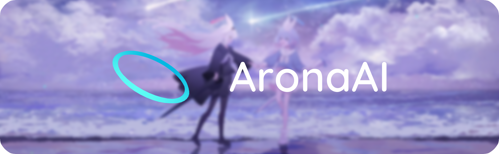

<div align="center">



# AronaAI

一个基于 PySide6 和 QFluentWidgets 的 Windows 桌面应用

   

</div>

---

## 如何使用

### 1. 克隆仓库

```bash
git clone https://github.com/33770046/AronaAI.git
cd AronaAI
```

### 2. 创建并激活虚拟环境

```bash
python -m venv .venv
.venv\Scripts\activate
```

### 3. 安装依赖

```bash
pip install -r requirements.txt
```

### 4. 运行项目

```bash
python main.py
```

### 5.构建项目

```bash
pyinstaller AronaAI.spec --noconfirm --clean
move "dist\AronaAI-TTS" "dist\AronaAI\TTS"
```

---

## 项目结构

```
AronaAI/
├── main.py                     # 入口
├── AronaAI.spec                # PyInstaller 打包配置
├── requirements.txt            # 依赖
├── README.md
├── LICENSE
├── COPYRIGHT
│
├── config/                     # 运行时配置
├── data/                       # 活动缓存
├── tts_cache/                  # TTS 合成缓存
├── gsv_models/                 # TTS 基础模型（使用 TTS 时出现）
│
├── Assets/
│   ├── homepage.png
│   ├── Font/
│   ├── HomePage/
│   ├── Logo/
│   ├── Chat/
│   │   ├── config.ini          # 成员映射
│   │   ├── arona/
│   │   │   ├── arona.md        # 提示词
│   │   │   └── logo.png        # 头像
│   │   └── plana/
│   │       ├── plana.md
│   │       └── logo.png
│   ├── TTS/
│   │   ├── config.ini          # 语音包清单
│   │   ├── Arona_CN/           # 阿洛娜中文语音包
│   │   ├── Arona_JP/           # 阿洛娜日文语音包
│   │   └── Plana_JP/           # 普拉娜日文语音包
│   └── Spine/
│       ├── config.ini          # Spine 模型中文映射
│       ├── arona/              # Arona Spine 模型（需自行放置）
│       ├── plana/              # Plana Spine 模型（需自行放置）
│       └── web/
│           ├── index.html
│           ├── spine-player.js     # 应用会自行下载
│           └── spine-player.css    # 应用会自行下载
│
└── App/
    ├── __init__.py
    ├── main_window.py          # 主窗口（MSFluentWindow）
    ├── config.py               # 配置管理（QConfig + config.json）
    ├── ai_chat.py              # AI 聊天（API调用 + 历史记录）
    ├── agent.py                # AI Agent（function calling + 工具）
    ├── backdrop.py             # DWM 毛玻璃背景
    ├── scale_utils.py          # DPI 缩放
    ├── scroll_utils.py         # 触控滚动
    ├── update_utils.py         # 资源路径 + Spine 运行时
    ├── tts/
    │   ├── __init__.py
    │   ├── tts_engine.py       # TTS 引擎（热驻留子进程管理 + 模型预取单飞 + 音频播放）
    │   ├── tts_child.py        # TTS 子进程（模型常驻 + 推理 + 预热 + 基础模型下载）
    │   ├── tts_host.py         # 打包专用入口（AronaAI-TTS.exe 由此构建）
    │   └── tts_config.py       # 语音包检测 + GPU/CUDA 支持探测
    ├── pages/
    │   ├── __init__.py
    │   ├── home_page.py        # 首页
    │   ├── chat_page.py        # 对话页（成员列表 + 聊天）
    │   ├── chat_bubble.py      # 聊天气泡
    │   ├── schedule_page.py    # 日程页
    │   ├── settings_page.py    # 设置页（AI配置 + 模型选择 + TTS）
    │   ├── about_page.py       # 关于页
    │   └── spine_window.py     # Spine 桌面窗口
    └── crawler/
        ├── __init__.py
        ├── models.py           # 数据模型
        ├── gamekee.py          # GameKee 爬虫
        ├── images.py           # 图片下载
        └── api_worker.py       # API 工作线程
```

---

## 特别提醒

请确保您的计算机有足够的硬盘（至少7GB）存储空间

同时，在使用 TTS 功能时：

1. 应用内存占用峰值可能达到3GB，请确保内存剩余空间足够。
2. 使用**GPU 加速**需要您的 NVIDIA 显卡支持 CUDA 12.6，且显存最好大于等于4GB。
3. TTS 模块使用了 [chinokikiss/GSV-TTS-Lite](https://github.com/chinokikiss/GSV-TTS-Lite)，支持的 GPT-SoVITS 模型有 V2、V2Pro、V2ProPlus（中、日、英）。

---

## 重要声明——版权声明

1. **源代码**：本程序（指逻辑代码、脚本、配置文件）遵循 GNU General Public License v3.0 开源协议。
2. **美术资源**：本程序所使用的所有立绘、CG、音频、Spine 模型、图片、MomoTalk主题等美术素材，其知识产权及所有权均归 Nexon / Yostar 及其关联公司所有。
3. **免责声明**：本应用为粉丝制作的非商业性同人作品，仅供学习与交流使用，请勿用于任何商业用途或非法分发。
4. **许可证隔离**：本项目中的美术资源不适用 GPLv3 协议。使用、修改或分发这些资源时，需遵守《著作权法》及版权方（Nexon/Yostar）的相关规定，因滥用美术资源引发的法律责任由行为人自行承担。
